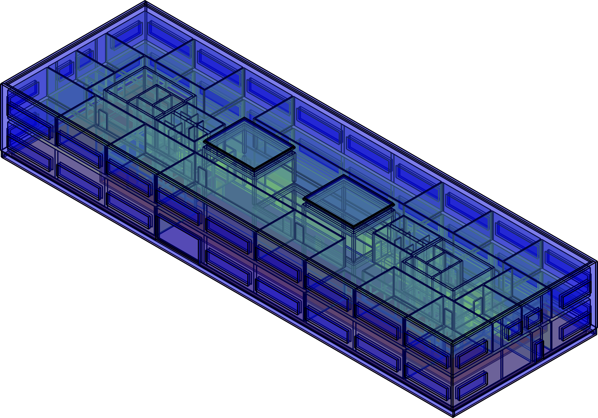
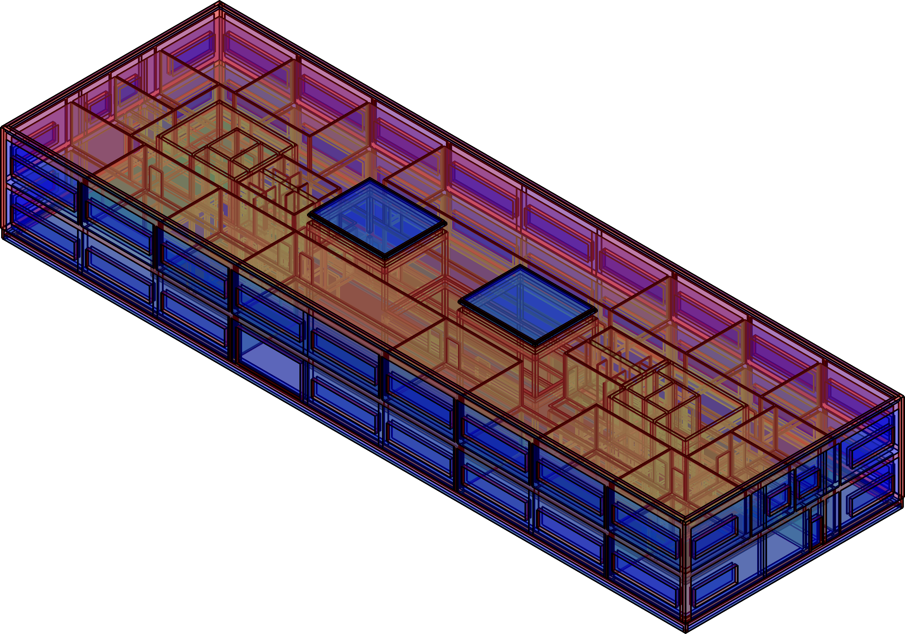
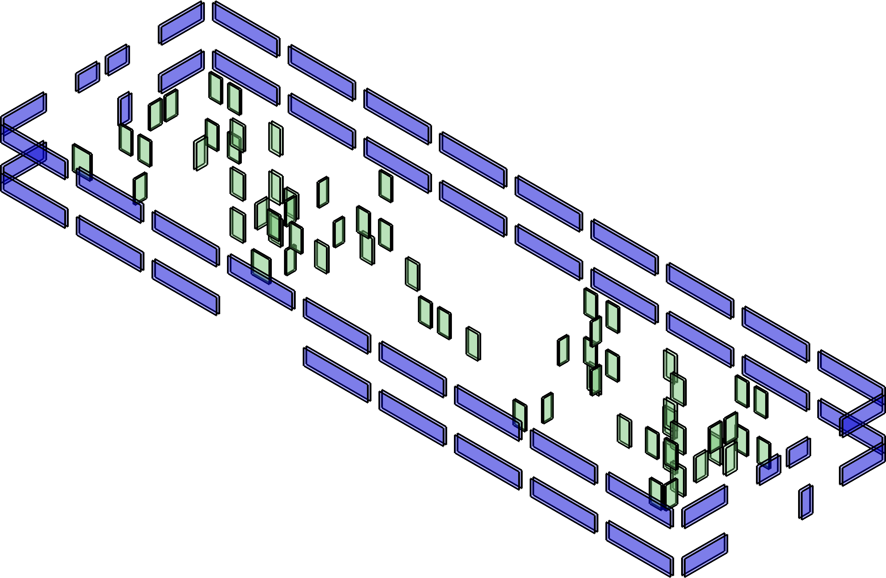
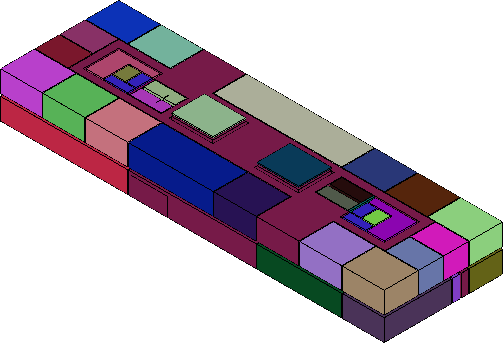
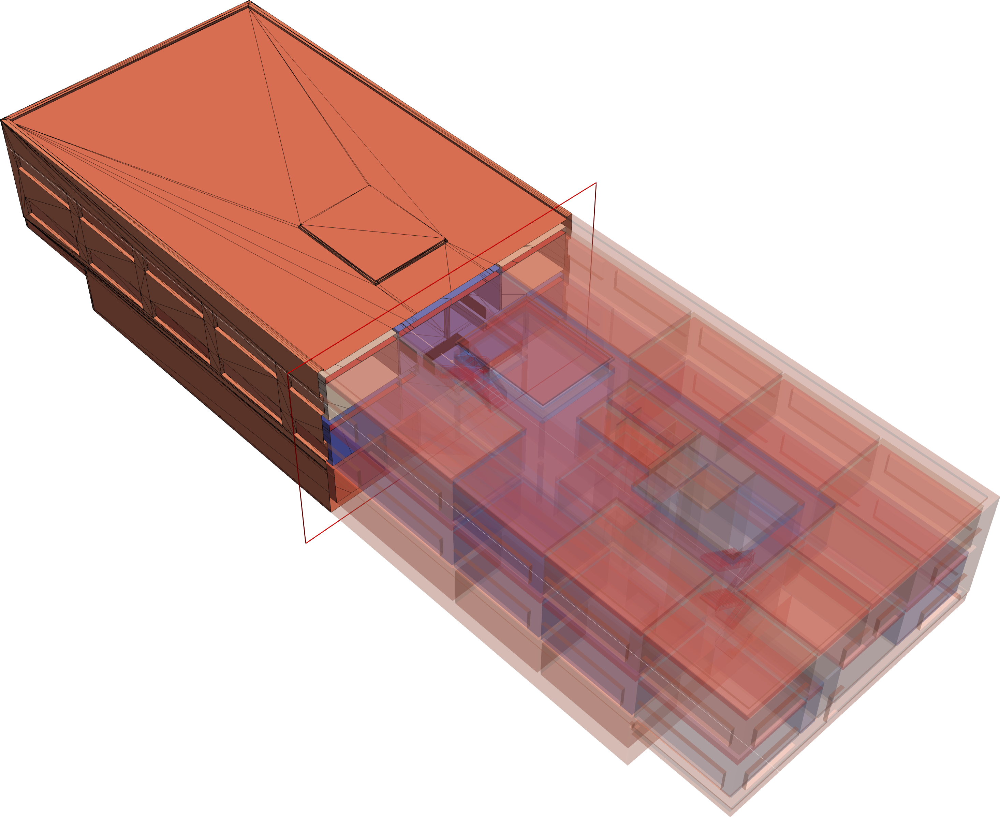

[](https://www.gnu.org/licenses/lgpl-3.0)
-----------

#  &nbsp; Industry Foundation Classes to Space Boundaries
**Generation of simulation geometries for CFD and BEPS.**  
**Partially developed within the BIM2SIM project.**

## Installation on *nix
####  Prerequisites and dependencies
An instruction (Dockerfile) can be found [here](additionals/Dockerfile)

**Miscellaneous**
```bash
sudo apt-get install git cmake gcc g++
```

[**OpenCascade 7.5.0**](https://dev.opencascade.org/release)

```bash
# this will install most of the third-party libraries needed by OpenCascade
sudo apt-get install tcllib tklib tcl-dev tk-dev libfreetype-dev libxt-dev libxmu-dev libxi-dev libgl1-mesa-dev libglu1-mesa-dev libfreeimage-dev libtbb-dev qt5-default libomp-dev
```

[**IfcOpenShell 0.6.0**](https://github.com/IfcOpenShell/IfcOpenShell)

```bash
sudo apt-get install libboost-all-dev libxml2-dev
```

[**R-Trees: A Dynamic Index Structure for Spatial Searching**](https://github.com/nushoin/RTree)  
Already included as header-only

[**Clipper 6.4.2 - an open source freeware library for clipping and offsetting lines and polygons**](http://www.angusj.com/delphi/clipper.php)
```bash
sudo apt-get install libpolyclipping-dev 
```

[**(CGAL)**](https://www.cgal.org/)
```bash
sudo apt-get install libcgal-dev
```

####  Build
```bash
mkdir build
cd build
cmake ../cmake # or ccmake for GUI, argument _-DSTATIC_OCC_IFCOS=OFF_ or _ON_ for dynamic or static build (includes OCC and IfcOpenShell), -DCLIPPER_INCLUDE_PATH="/usr/include/polyclipping"
make -j16 # number of CPU
```

## Usage examples
IFC result file:
```bash
./IFC2SB -j16 --graph /home/fluid/Downloads/IFCfiles/AC20-FZK-Haus.ifc 
```

STL result file:
```bash
./IFC2SB -j16 --graph --stl /home/fluid/Downloads/IFCfiles/AC20-FZK-Haus.ifc 
```

SB Viewer:
```bash
./IFCRB /home/fluid/Downloads/IFCfiles/AC20-FZK-Haus_with_SB.ifc s
s = 1 for 1stLvlSB, s = 2 for 2ndLvlSB
```


## Results
**Space Boundaries for BEPS as .ifc**   
First level space boundaries, attributed according to IFC4   


Second level space boundaries, attributed according to IFC4 (e.g. opening SBs, right image)   
 

Spaces  


**Geometry for CFD as .stl**   


## How to cite IFC2SB
```bibtex
@phdthesis{Fichter2022,
	title        = {Automatisierte Erzeugung geometrischer Modelle für die Gebäudesimulation im Kontext des Building Information Modeling},
	author       = {Fichter, Eric},
	year         = 2022,
	school       = {RWTH Aachen University}
}
@inproceedings{Fichter2021,
	title        = {Automatic generation of second level space boundary geometry from {IFC} models},
	author       = {Fichter, Eric and Richter, Veronika and Frisch, Jerome and {van Treeck}, Christoph},
	year         = 2021,
	booktitle    = {Proceedings of Building Simulation 2021: 17th Conference of IBPSA}
}
@software{IFC2SB,
	title        = {IFC2SB},
	author       = {{Fichter, Eric}},
	url          = {https://git.rwth-aachen.de/fichter/ifc2sb},
	version      = {1.0},
	date         = {2022-01-01}
}
```

## Contact
   

Eric Fichter   
fichter@e3d.rwth-aachen.de  
[E3D - Institute of Energy Efficiency and Sustainable Building  ](https://www.e3d.rwth-aachen.de/cms/~iyld/E3D/?lidx=1)     
RWTH Aachen University
